# ミンスキーレジスタマシンを用いたパターン繰り返し迷路の生成

## 概要

繰り返し迷路 (repeated maze) は、同一のブロックパターンが格子状に繰り返し並ぶ迷路で、意外に遠い場所に迂回してから戻ってくることでゴールに到達するような、複雑な経路構造を持つことがある。
本稿では、ミンスキー (Minsky) のレジスタマシン (program machine) を Haskell 形式の状態遷移関数として記述し、これを機械的に **2 次元の繰り返し迷路** (有向グラフ／無向グラフのいずれか) に変換する手法を示す。
その応用として、「カウンターポンプ」 「ミンスキー倍加マシン (Minsky doubling machine)」 「ペンテーション迷路」 の 3 種類の繰り返し迷路を構築し、 ミンスキーマシン埋め込みによって最短経路長がブロックの大きさに対して **巨大関数オーダー** ($2 \uparrow\uparrow\uparrow n$ 級) まで陽に爆発することを実例によって示す。

## 1. はじめに

### 1.1 過去の繰り返し迷路研究

繰り返し迷路の歴史は別稿「[繰り返し迷路の歴史](https://googology.fandom.com/ja/wiki/%E3%83%A6%E3%83%BC%E3%82%B6%E3%83%BC%E3%83%96%E3%83%AD%E3%82%B0:Koteitan/%E7%B9%B0%E3%82%8A%E8%BF%94%E3%81%97%E8%BF%B7%E8%B7%AF%E3%81%AE%E6%AD%B4%E5%8F%B2)」に詳述したが、同じ構造が繰り返される迷路の例は 1999 年頃から存在していた。

- **フラクタル迷路** (Mark J. P. Wolf, 1999): 同じ迷路の縮小版が再帰的に埋め込まれる構造。
- **端に異なる迷路がある繰り返し迷路**: 連続の迷路。[omeometo の日記の「2 次元的な奴」の章](https://omeometo.hatenablog.com/entry/2018/12/28/155549)にてコンセプトが紹介され、omeometo の twitter にて[ピラミッド迷路](https://x.com/omeometo/status/1436627948677648384)が実装例として紹介された。

下記はフラクタル迷路の例である。

<!-- この画像は fandom 上では Kot-mazes-extropy-fractal-maze.png で引用できる。 -->
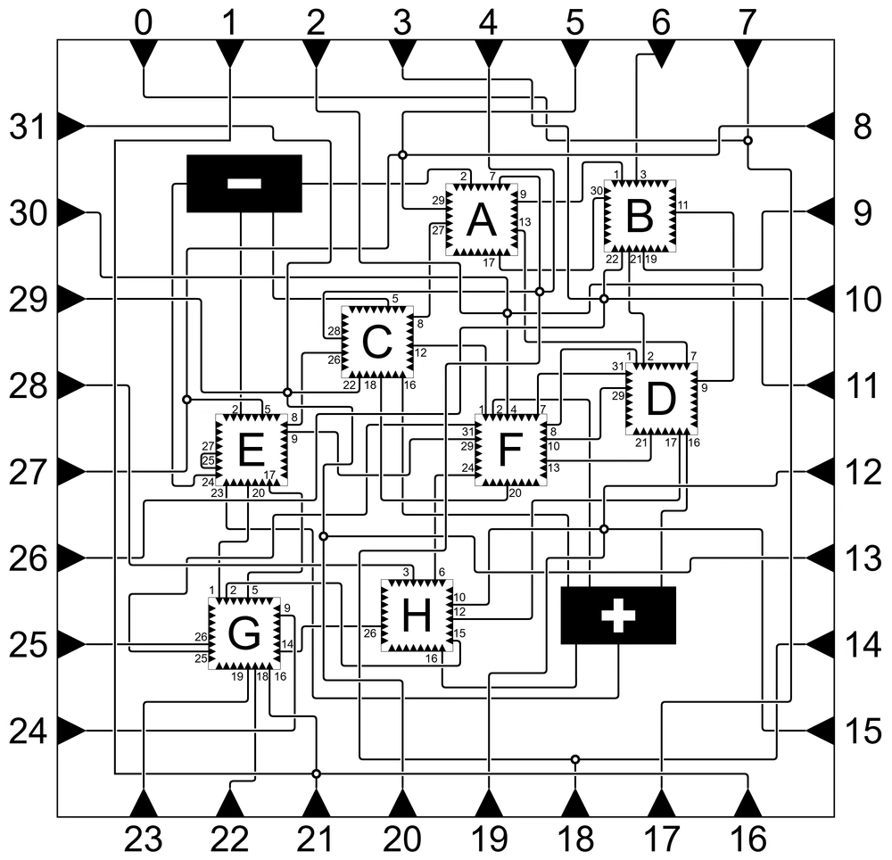

[^fractal]: フラクタル: ここで言う "フラクタル" は [1981 John E. Hutchinson, "Fractals and Self Similarity"](https://maths-people.anu.edu.au/~john/Assets/Research%20Papers/fractals_self-similarity.pdf) でのフラクタルの定義に従い、縮小倍率 $\text{Lip}F \lt 1$ を用いる。

### 1.2 フラクタル迷路の複雑性
$N$ 端子フラクタル迷路の最浅解の深さは $\Theta(N^2)$ で抑えられることが De Biasi によって証明された。 ([De Biasi, 2012](https://cstheory.stackexchange.com/questions/11024/decidability-of-fractal-maze))。

### 1.3 omeometo の示唆

2018 年の omeometo 氏のブログ記事「[fractal mazeとか](https://omeometo.hatenablog.com/entry/2018/12/28/155549)」では、二次元繰り返し迷路に[ミンスキーのレジスタマシン](https://ja.wikipedia.org/wiki/%E3%82%AB%E3%82%A6%E3%83%B3%E3%82%BF%E3%83%9E%E3%82%B7%E3%83%B3)を埋め込むことで、ゴール到達判定がチューリングマシンにて決定不能になるという観察と略証が与えられた。

> 2 個のレジスタの値 $(a, b)$ をピラミッドのブロックの座標（頂上から左下に $a$ 個、右下に $b$ 個移動した位置）に対応させ、各ブロックの中に状態の数だけ頂点を作り、プログラムの遷移に対応して辺を張る（赤がインクリメント命令、青がデクリメント命令）ことで迷路ができるので、この形の迷路である場所からある場所に行けるかどうかの判定問題も決定不能になることがわかる。
>
> — omeometo, 2018

omeometo 氏は、 ブロック $A$ が $(x, y)$ ($x > 0, y > 0$) の位置に、 ブロック $B$ が $(0, y)$ ($y > 0$) の位置に、 ブロック $C$ が $(x, 0)$ ($x > 0$) の位置に反復的に並んでおり、 ブロック $D$ が $(0, 0)$ にあり、 それぞれのブロックの中に状態に対応したターミナルを繋ぐ有向グラフのポートがある図を描いている。

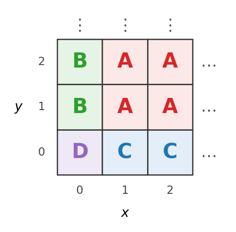

図: omeometo 型のブロック配置 ([omeometo, 2018](https://omeometo.hatenablog.com/entry/2018/12/28/155549) の図をもとに描き直したもの)。 右方向と上方向に同じ並びが続く。

さらに同記事では以下が問いかけられた:

> 決定不能なのだとしたら、解の最小手数が問題の「見た目」に対して「考えられないほど」膨れ上がるような問題が存在する、ということで、パズル的にはオイシイわけです。誰かなんか面白いの作りませんかね。
>
> — omeometo, 2018

[ペンテーション迷路](https://googology.fandom.com/ja/wiki/%E3%83%A6%E3%83%BC%E3%82%B6%E3%83%BC%E3%83%96%E3%83%AD%E3%82%B0:Koteitan/%E3%83%9A%E3%83%B3%E3%83%86%E3%83%BC%E3%82%B7%E3%83%A7%E3%83%B3%E8%BF%B7%E8%B7%AF) はこの問いへの一つの回答だったが、[コラッツ迷路](https://x.com/koteitan/status/1439100327697862657)に近い "周期構造に計算過程を埋め込む" 設計のため、ブロック種類が多く、配置も複雑だった。

下記はペンテーション迷路の一部の図である。

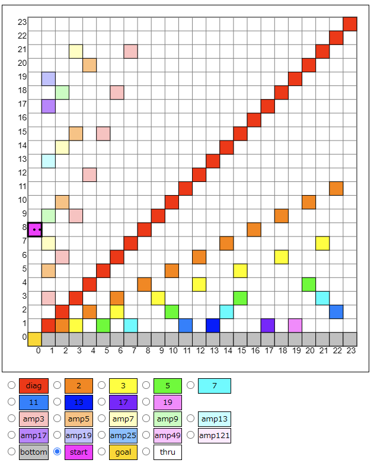

23種類のブロック種類があり、また、その配置は単純ではなく複雑な規則性を持っている。

omeometo 氏の繰り返し迷路とコラッツ迷路型の違いを以下に整理する:

| 観点 | omeometo 型 | コラッツ迷路型 |
|---|---|---|
| ブロック種類数 | 4 種 ($A$ / $B$ / $C$ / $D$) | 23 種 |
| ブロックの配置 | 左端に $B$、 下端に $C$、 原点に $D$、 残りは $A$ で単純 | ブロック種別によって異なる直線上に、 異なる間隔で特定のブロック種別のブロックが配置されている |
| 実装内容とアーキテクチャの分離 | ブロック種別とその配置はアーキテクチャによって不変。ターミナル配置・ポート配置は実装内容依存 | ターミナル配置・ポート配置・ブロック種別・ブロック配置がすべて実装内容既存 |

### 1.4 本研究の貢献

本研究の貢献は次の六点である。

1. **汎用コンパイラ `hs2maze`**: 任意の 2 レジスタミンスキーマシンを Haskell 風構文で記述すれば、対応する 2 次元繰り返し迷路 (無向グラフ) を機械的に生成できる Python ツールを実装した。
2. **n レジスタ → 2 レジスタの Gödel 化コンパイラ `nd-to-2d`**: 任意の n レジスタミンスキーマシンの Haskell ソースを Gödel 符号化 ($x = \prod p_i^{r_i}$) によって 2 レジスタ版に変換するコンパイラを実装した。これにより、3 レジスタ以上のミンスキーマシン (例: counter-pump-3) も `hs2maze` 経由で迷路化できる。
3. **任意の $D$ レジスタミンスキーマシン → 4 種ブロック繰り返し迷路**: 貢献 1 と 2 を組み合わせることで、 任意の $D$ レジスタミンスキーマシンで表される計算を **`normal` / `nx` / `ny` / `zero` の 4 種類のブロックの繰り返し** で表現できることが分かった。
4. **具体的な迷路族の構築**: 上記のコンパイラを用いて、 オーダーの異なる 4 種類の迷路族を構築した。
   - **4-1. カウンターポンプ (cp2)**: 反復回数 $n$ に対して経路長 $\Theta(n^2)$ の 2 レジスタ迷路。
   - **4-2. カウンターポンプ-3 (cp3)**: 3 レジスタ版を `nd-to-2d` で 2 レジスタ化し、 cp2 より高次の多項式オーダーの経路長を持つ迷路。
   - **4-3. ミンスキー倍加マシン (md)**: サイクル数 $k$ に対して経路長 $\Theta(2^k)$ の指数オーダー迷路。
   - **4-4. ペンテーション迷路 (penta)**: 入力 $n$ に対して経路長 $\Omega(3^{2 \uparrow\uparrow\uparrow n})$ の巨大関数オーダー迷路。 旧版が 23 種類のブロックで実現していたものを **均一な 4 種ブロック** で再構築した。
5. **繰り返し迷路ビューワー・ソルバーの作成**: 上記の各迷路を Web ブラウザで描画・探索できるビジュアライザと、 BFS による経路長実測ソルバーを作成し公開した ([repeated-maze](https://koteitan.github.io/repeated-maze/))。
6. **Lean による形式証明**: 4 種ブロックの繰り返し迷路について、 次の 2 つを Lean 4 + Mathlib で `sorry` なしに証明した ([lean/README-ja.md](../lean/README-ja.md))。 使う公理は Lean の標準公理だけである。
   - **6-1. 到達判定の決定不能性**: 迷路を入力として、 start から goal に着けるかを判定するアルゴリズムは存在しない。 ポートを一方通行とする場合 (有向) と、 両方向に進める場合 (無向) の両方で成り立つ。 §1.3 の omeometo 氏の略証が述べた決定不能性を、 本研究の迷路の形式で形式化したものにあたる。
   - **6-2. 最短経路長の増大 (主定理)**: ポート数 $n$ 以下の解ける迷路の最短経路長の最大値を $L(n)$ とすると、 どんな計算可能関数 $f$ についても $\exists n,\ L(n) > f(n)$ が成り立つ。 すなわち $L(n)$ はどんな計算可能関数でも上から抑えられない。 これは §1.3 の omeometo 氏の問い「解の最小手数が問題の見た目に対して考えられないほど膨れ上がる問題」が存在することの、 形式的な裏付けである。

貢献 1-3 の変換の流れを以下に示す:

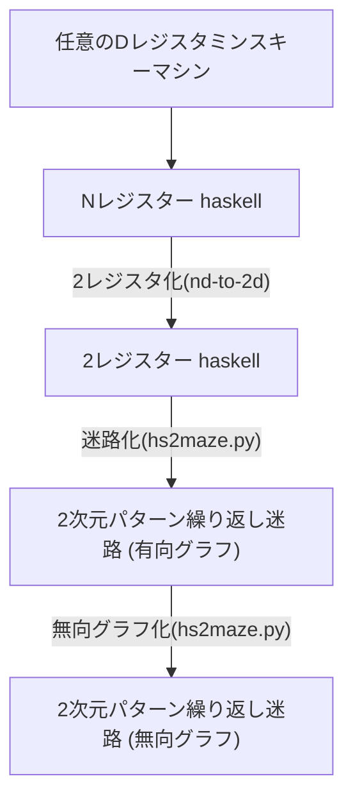

---

## 2. ミンスキーレジスタマシンの定式化

ミンスキー (Marvin L. Minsky) は文献 [Minsky 1967, Ch.11] において **program machine** (以下、 本稿では単に「ミンスキーマシン」) を定義した。 本研究では一般の $D$ レジスタ版を用いる ($D \geq 2$)。 §5 で述べる Gödel 化コンパイラ `nd-to-2d.py` 以前のフェーズでは $D \geq 3$ も扱い、 後段で $D = 2$ に圧縮する。

$D$ レジスタミンスキーマシン $M$ は次の組で与えられる:

\begin{eqnarray}
M &=& (R, P, \iota, p_\mathrm{start}, p_\mathrm{halt})\\
R &=& (r_0, r_1, \ldots, r_{D-1}) \in \mathbb{N}^D &\quad \text{レジスタ}\\
P &=& \{0, 1, \ldots, N_p - 1\} &\quad \text{プログラム行集合}\\
\iota: P &\to& I &\quad \text{命令表}
\end{eqnarray}

下記は $R$, $P$, $\delta$ の模式図である。

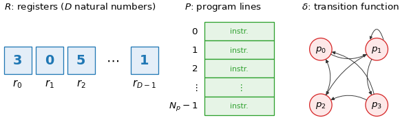

命令表 $\iota$ は各行 $p \in P$ に次のいずれかの命令を割り当てる ($0 \leq i < D$, $p', p'' \in P$)。 1 ステップの遷移 $\delta(p, R)$ は $\iota(p)$ から決まる部分関数である ($e_i$ は第 $i$ 成分だけ 1 のベクトル):

| 命令 $\iota(p)$ | $\delta(p, R)$ |
|---|---|
| $\mathrm{INC}(r_i, p')$ | $(p', R + e_i)$ |
| $\mathrm{DEC}(r_i, p', p'')$ | $r_i > 0$ なら $(p', R - e_i)$、 $r_i = 0$ なら $(p'', R)$ |
| $\mathrm{HALT}$ | 定義しない (計算停止) |

ミンスキーは $D = 2$ の program machine が既にチューリング完全であることを示した。
すなわち、 任意の計算可能関数 $f: \mathbb{N} \to \mathbb{N}$ について、 適切な $M$ を構成すれば $r_0$ に入力を置いて実行することで他のレジスタに $f(r_0)$ を得ることができる。 $D \geq 3$ は表現の利便性のために用いるもので、 計算能力としては $D = 2$ と等価である。

本稿で扱うミンスキーマシンは、 加えて **プログラムカウンタ** $p$ を「インストラクションラベル」と呼ばれる任意の有限名前空間に取ってよいものとする (内部的には自然数で名づけた行に同一視できる)。

---

## 3. パターン繰り返し迷路の定式化

繰り返し迷路の定式化は [ペンテーション迷路](https://googology.fandom.com/ja/wiki/%E3%83%A6%E3%83%BC%E3%82%B6%E3%83%BC%E3%83%96%E3%83%AD%E3%82%B0:Koteitan/%E3%83%9A%E3%83%B3%E3%83%86%E3%83%BC%E3%82%B7%E3%83%A7%E3%83%B3%E8%BF%B7%E8%B7%AF) と同等のものを、本稿で扱う 2 次元・$n$ ターミナル版に簡略化して定義し直す。

下記はパターン繰り返し迷路の模式図である。 

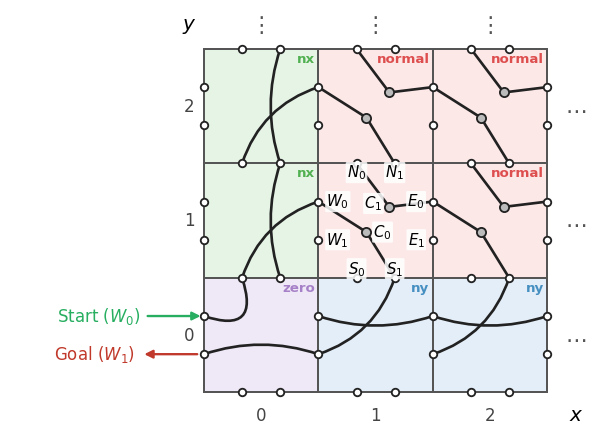

### 3.1 ブロックとターミナル

繰り返し迷路は格子点 $(x, y) \in \mathbb{Z}_{\geq 0}^2$ に **ブロック** が配置されて構成される。各ブロックには 4 辺 + 中央の合計 5 種類の **ターミナル** が定義される:

- 辺ターミナル (各辺ごとに本数が異なってよい):
  - **西辺 (W)** に $W_0, W_1, \ldots, W_{T_W - 1}$ ($T_W$ 個)
  - **東辺 (E)** に $E_0, \ldots, E_{T_E - 1}$ ($T_E$ 個)
  - **南辺 (S)** に $S_0, \ldots, S_{T_S - 1}$ ($T_S$ 個)
  - **北辺 (N)** に $N_0, \ldots, N_{T_N - 1}$ ($T_N$ 個)
- **中央 (C) ターミナル**: ブロック内部に配置される論理的な接続点 $C_0, C_1, \ldots, C_{T_C - 1}$ ($T_C$ 個)。 ポート分解 (§6) のための内部接続ハブとして使われる。

各辺の本数 $T_W, T_E, T_N, T_S, T_C$ はブロック種別 (`normal` / `nx` / `ny` / `zero`、 §3.3) ごとに別々に決まる。 `hs2maze` (§6 / §7) が出力するポート集合に応じて自動的に決定される。 全ターミナル数を表す総和を $T \;=\; T_W + T_E + T_N + T_S + T_C$ とする。

隣接ブロックの辺ターミナルは同一点として共有される。 すなわち、

- $E_k @ (x, y)$ と $W_k @ (x+1, y)$ は同一の点を指し、
- $N_k @ (x, y)$ と $S_k @ (x, y+1)$ は同一の点を指す。

C ターミナルはブロック内部の点であり、 隣接ブロックと共有されない。

### 3.2 ポート

ブロック内部で 2 つのターミナル間を結ぶ辺を **ポート (port)** と呼ぶ。
ポートは有向辺と無向辺いずれの形式でも定義可能である。

- **有向ポート** $A \to B$: ターミナル $A$ からターミナル $B$ への一方通行。
- **無向ポート** $A - B$: $A \leftrightarrow B$ の双方向通行。

### 3.3 ブロック種別

格子点 $(x, y)$ の値によって、4 種類のブロック種別を使い分ける:

| 種別 | 配置位置 | 役割 |
|---|---|---|
| **normal** | $x \geq 1 \land y \geq 1$ | 主たる計算ブロック |
| **nx** | $x = 0 \land y \geq 1$ | $r_0 = 0$ (=$x = 0$) のゼロテストの分岐先 |
| **ny** | $x \geq 1 \land y = 0$ | $r_1 = 0$ (=$y = 0$) のゼロテストの分岐先 |
| **zero** | $x = 0 \land y = 0$ | $r_0 = r_1 = 0$ の同時ゼロテスト分岐先 (角ブロック) |

`normal` ブロックの中身は格子全体で同一のポートセットを持つ ("繰り返し" という名の所以)。
`nx` / `ny` / `zero` ブロックも同様に同一だが、`normal` と異なるポートセットを持ち、ゼロ分岐先の役割を担う。
maze ファイル (例: `maze/counter-pump/cp2-4.maze`) は `normal: ...; nx: ...; ny: ...; zero: ...` の 4 セクション形式で記述される。

### 3.4 スタート・ゴールと解

スタート地点はブロック $(0, 0)$ の $W_0$ ターミナル、 ゴール地点は同ブロックの $W_1$ ターミナルとする (いずれも `zero` ブロックの西辺の最初の 2 ターミナル)。
内部的には `hs2maze` がブロック内に予約 C ターミナル $C_0$ / $C_1$ を bridge anchor として配置し、 $W_0 - C_0$ (start から user PC 0 への入口) と $C_1 - W_1$ (HALT 行先 user PC 1 から goal への出口) のポートで接続している (詳細は §4.1)。
スタートからポートを順に辿ってゴールに到達できる状態列を **解** と呼ぶ。
解の長さ (=遷移したポート数) のうち最小のものを **最短解長** と呼ぶ。

---

## 4. ミンスキーマシンの Haskell 表現

$D$ レジスタミンスキーマシン $M$ を Haskell 風の関数 (パターンマッチ付きの再帰関数) で表現する。 レジスタ $(r_0, r_1, \ldots, r_{D-1})$ をそのまま用い、 プログラムカウンタを $\mathit{pc}$ とする。 関数の引数は $(D + 1)$-組 $(r_0, r_1, \ldots, r_{D-1}, \mathit{pc})$ となる。

具体例として $D = 3$ の場合の関数シグネチャは以下のようになる:

```haskell
machine :: (Int, Int, Int, Int) -> (Int, Int, Int, Int)
machine (r0, r1, r2, pc_src) = machine (r0', r1', r2', pc_dst)
```

各行は遷移 $(r_0, r_1, r_2, p) \to (r_0', r_1', r_2', p')$ を表す。

ミンスキー命令の符号化は以下の通り (レジスタ $r_k$ ($0 \leq k < D$) を対象とする命令の汎用形):

| ミンスキー命令 | Haskell 行 |
|---|---|
| $\mathrm{INC}(r_k, p')$ | `machine (r0, ..., rk,   ..., r{D-1}, p) = machine (r0, ..., rk+1, ..., r{D-1}, p')` |
| $\mathrm{DEC}(r_k, p', p'')$ (ゼロでない場合) | `machine (r0, ..., rk,   ..., r{D-1}, p) = machine (r0, ..., rk-1, ..., r{D-1}, p')` |
| $\mathrm{DEC}(r_k, p', p'')$ (ゼロの場合) | `machine (r0, ...,  0,   ..., r{D-1}, p) = machine (r0, ...,  0,   ..., r{D-1}, p'')` ($k$ 番目を `0` でパターンマッチ) |
| $\mathrm{HALT}$ | `machine (r0, ..., r{D-1}, p) = (r0, ..., r{D-1}, -1)` (または該当行を書かない) |

各行とも、 対象レジスタ $r_k$ の位置にだけ `+1` / `-1` / `0` パターンを書き、 他のレジスタはそのまま流す。

Haskell の上から順にパターンマッチさせる挙動を利用し、 ゼロ分岐 (`DEC` のゼロ側) を一般行より先に書くことでゼロテストを実現する。

### 4.1 予約 PC 値と bridge 機構

便宜上、`hs2maze` では以下の PC 値を予約する。

| PC | 役割 |
|---|---|
| 0 | ユーザ Haskell のエントリポイント (実行開始時の最初の rule)。 |
| 1 | HALT の行先 (停止状態)。 |
| 2 以上 | ユーザ定義状態。 |

スタート / ゴール (= ブロック $(0, 0)$ の $W_0$ / $W_1$) は、 同ブロック内部に予約された C ターミナル $C_0$, $C_1$ を経由して PC 0 / PC 1 に接続される。 具体的には:

- **スタート bridge**: $W_0 - C_0$ (zero / nx / ny / normal の各ブロックに配置)。 スタート (ブロック $(0, 0)$ の $W_0$) から $C_0$ に入り、 そこから user PC 0 を符号化したポート群に接続される。
- **ゴール bridge**: $C_1 - W_1$ (同上)。 user PC 1 (= HALT) を符号化したポート群が $C_1$ に到達し、 そこから $W_1$ を経由してゴール (ブロック $(0, 0)$ の $W_1$) に出る。

迷路に解が存在するためには、 ミンスキーマシンが $\mathit{pc} = 1$ に到達する時点で全レジスタ $(r_0, r_1, \ldots, r_{D-1})$ が 0 に戻っている必要がある (Gödel 化後は $(x, y) = (0, 0)$ に戻ってから HALT する、 と表される)。

---

## 5. ゲーデル数化による 2 レジスタ化 (`nd-to-2d`)

ミンスキーマシンが本来必要とするレジスタ数は問題によっては 3 以上になる (例: 複数のカウンタを独立に管理する場合)。
一方、§3 の繰り返し迷路は 2 次元格子 $(x, y)$ にレジスタ $(r_0, r_1)$ を直接対応させる構造を持つため、 そのままでは 2 レジスタしか扱えない。

ツール `tools/nd-to-2d/nd-to-2d.py` は、 任意の **n レジスタミンスキーマシン** の Haskell ソースを **2 レジスタ + ゲーデル数符号化版** Haskell に機械的にコンパイルする。 これにより、 任意の n レジスタミンスキーマシンを後段の `hs2maze` (§6 / §7) で迷路化できる。

### 5.1 ゲーデル符号化の定式化

n 個のレジスタ $(r_0, r_1, \ldots, r_{n-1})$ を、 互いに異なる素数 $p_0 = 2, p_1 = 3, p_2 = 5, \ldots$ のべき乗の積として 1 つの自然数 $x$ に圧縮する:

\begin{eqnarray}
x &=& \prod_{i=0}^{n-1} p_i^{r_i}
\end{eqnarray}

素因数分解の一意性により、 写像 $(r_0, \ldots, r_{n-1}) \leftrightarrow x$ は **単射** (互いに 1 対 1 対応) となる。 よって、 異なる n レジスタ状態は必ず異なる $x$ にマップされ、 状態の重複は起こらない。

`nd-to-2d.py` では、 残る 1 つのレジスタ $y$ をプログラムカウンタや拡張領域として確保し、 全体として $(x, y, \mathit{pc})$ の 2 レジスタ + PC 構成にする。

§4 の Haskell 表現との関係: Gödel 化を経た 2 レジスタ Haskell では、 引数を慣例的に $(x, y, \mathit{pc})$ と書く ($x$ は元の n レジスタの Gödel 符号化値、 $y$ は補助レジスタ)。 §3 (迷路の格子座標) との対応は、 Gödel 化後の $(x, y)$ がそのままブロック格子点 $(x, y)$ に対応する、 という関係になる。

### 5.2 命令の分解

n レジスタの基本命令を 2 レジスタの基本命令の連鎖に展開する:

| n レジスタ命令 | 2 レジスタの実装 |
|---|---|
| $\mathrm{INC}(r_i)$ | $x \mathbin{*}= p_i$ (§5.2.1) |
| $\mathrm{DEC}(r_i)$ (非ゼロ側) | $x \mathbin{/}= p_i$ (§5.2.2) |
| $\mathrm{DEC}(r_i)$ (ゼロ判定) | $x \bmod p_i = 0$ の判定 (§5.2.3) |
| $\mathrm{HALT}$ | そのまま 2 レジスタ HALT |

以下、 補助レジスタ $y$ を一時的に使うサブルーチンとして実装する (各サブルーチンの前後で $y = 0$ が保たれる)。 中間 PC は **生成器が新規に割り当て** て元 PC と衝突しないように管理する。

#### 5.2.1 $x \mathbin{*}= p_i$

$x$ に素数 $p_i$ を掛ける。 2 phase 構成:

- **Phase A** (`entry`, `incy_*`): $x$ を 1 ずつ DEC しながら $y$ を $p_i$ 回ずつ INC するループ。 終了時 $x = 0$, $y = p_i \cdot x_\mathrm{init}$。
- **Phase B** (`drain`, `incx`): $y$ を 1:1 で $x$ にドレイン。 終了時 $x = p_i \cdot x_\mathrm{init}$, $y = 0$。

```haskell
-- Phase A: x → 0, y += p_i * x_init
godel (x, y, entry      ) = godel (x-1, y,   incy_0  )  -- DEC x
godel (0, y, entry      ) = godel (  0, y,   drain   )  -- nx: x=0 → Phase B へ
godel (x, y, incy_0     ) = godel (  x, y+1, incy_1  )  -- INC y (1 回目)
godel (x, y, incy_1     ) = godel (  x, y+1, incy_2  )
                  ...                                    -- p_i 個の INC y
godel (x, y, incy_{p-1} ) = godel (  x, y+1, entry   )  -- 1 round 完了

-- Phase B: y → x (1:1 drain)
godel (x, y, drain      ) = godel (  x, y-1, incx    )  -- DEC y
godel (x, 0, drain      ) = godel (  x,   0, exit    )  -- ny: y=0 → exit
godel (x, y, incx       ) = godel (x+1, y,   drain   )  -- INC x → drain へ
```

#### 5.2.2 $x \mathbin{/}= p_i$

$x$ を $p_i$ で割る。 $p_i \mid x$ (= $x$ が $p_i$ の倍数) を前提とする。

- **Phase A** (`entry`, `dec_*`, `incy`): $x$ を $p_i$ 個ずつ DEC して 1 round 達成ごとに $y$ を 1 INC するループ。 各 round の途中で $x = 0$ になった (= 割り切れない) 場合は trap PC へジャンプ。 終了時 $x = 0$, $y = x_\mathrm{init} / p_i$。
- **Phase B** (`drain`, `incx`): §5.2.1 と同形の 1:1 drain。 終了時 $x = x_\mathrm{init} / p_i$, $y = 0$。

```haskell
-- Phase A: x → 0, y += x_init / p_i (割り切れなければ trap)
godel (x, y, entry      ) = godel (x-1, y,   dec_1   )  -- DEC x (1 個目)
godel (0, y, entry      ) = godel (  0, y,   drain   )  -- nx: x=0 round 開始位置 → 終了
godel (x, y, dec_1      ) = godel (x-1, y,   dec_2   )
godel (0, y, dec_1      ) = godel (  0, y,   trap    )  -- nx: 割り切れない → trap
                  ...                                    -- p_i 個の DEC x
godel (x, y, dec_{p-1}  ) = godel (x-1, y,   incy    )
godel (0, y, dec_{p-1}  ) = godel (  0, y,   trap    )
godel (x, y, incy       ) = godel (  x, y+1, entry   )  -- 1 round 完了 → ループ

-- Phase B: y → x (1:1 drain) ─ §5.2.1 と同じ構造
godel (x, y, drain      ) = godel (  x, y-1, incx    )
godel (x, 0, drain      ) = godel (  x,   0, exit    )
godel (x, y, incx       ) = godel (x+1, y,   drain   )
```

#### 5.2.3 $x \bmod p_i = 0$ の判定

$x$ が $p_i$ で割り切れるかどうかを判定する **副作用なし** のサブルーチン (前後で $x$ の値は不変)。

- **Phase A** (`entry`, `dec_*`, `incy`): §5.2.2 と同様に $p_i$ 個ずつ DEC + INC y のループ。 ただし途中で $x = 0$ になっても trap せず、 **どの位置 $k \in \{0, 1, \ldots, p_i - 1\}$ で $x=0$ に達したか** を記録する分岐先を選ぶ。 $k = 0$ は割り切れた、 $k \geq 1$ は割り切れない。
- **Phase B** (`restore_k`): 各 $k$ ごとに専用の復元ルーチンを持つ。 $y$ を $x$ に drain しつつ、 「最後の round で先行して DEC してしまった $k$ 個の $x$」 を補填する。 終了時 $x = x_\mathrm{init}$ に戻り、 $k = 0$ なら `pass` (割り切れた)、 $k \geq 1$ なら `fail` (割り切れない) へ分岐。

```haskell
-- Phase A: x → 0、 round の途中で x=0 になった位置 k を nx 分岐先で識別
godel (x, y, entry      ) = godel (x-1, y,   dec_1     )
godel (0, y, entry      ) = godel (  0, y,   restore_0 )  -- nx (k=0): 割り切れた
godel (x, y, dec_1      ) = godel (x-1, y,   dec_2     )
godel (0, y, dec_1      ) = godel (  0, y,   restore_1 )  -- nx (k=1): 余り 1
                  ...                                      -- p_i 個の DEC
godel (x, y, dec_{p-1}  ) = godel (x-1, y,   incy      )
godel (0, y, dec_{p-1}  ) = godel (  0, y,   restore_{p-1})
godel (x, y, incy       ) = godel (  x, y+1, entry     )  -- 1 round 完了

-- Phase B (k=0): drain のみ (補填なし) で fail へ
godel (x, y, restore_0  ) = godel (  x, y-1, r0_incx   )
godel (x, 0, restore_0  ) = godel (  x,   0, fail      )  -- ny: y=0 → fail
godel (x, y, r0_incx    ) = godel (x+1, y,   restore_0 )

-- Phase B (k≥1): drain + 最後の round の 「先行 DEC した k 個」 を INC で補填して pass へ
godel (x, y, restore_k  ) = godel (  x, y-1, rk_incx   )
godel (x, 0, restore_k  ) = godel (  x,   0, rk_extra_0)  -- ny: y=0 → 補填へ
godel (x, y, rk_incx    ) = godel (x+1, y,   restore_k )
godel (x, y, rk_extra_0 ) = godel (x+1, y,   rk_extra_1)
                  ...                                      -- k 個の INC x
godel (x, y, rk_extra_{k-1}) = godel (x+1, y, pass     )
```

実装は `tools/nd-to-2d/nd-to-2d.py` の `mul_p` / `div_p` / `test_ndiv` 関数 (line 446-512) で各サブルーチンを生成している。

### 5.3 ステップ数の増え方

§5.2 の各サブルーチンは $x$ を 1 ずつ数えるループなので、 1 回の実行に $x$ に比例するステップ数がかかる (比例定数は $p_i$ で決まる)。 元の n レジスタマシンの実行が $T_n$ ステップで、 $t$ ステップ目のゲーデル数を $x_t = \prod_i p_i^{r_i(t)}$ とすると、 2 レジスタ版のステップ数 $T_2$ は

\begin{eqnarray}
T_2 &=& \Theta\Big( \sum_{t < T_n} x_t \Big)
\end{eqnarray}

となる。 各レジスタの最大値を $R_i = \max_t r_i(t)$ とおくと、 $x_t$ の最大値は $p_i^{R_i}$ 以上であり $\prod_i p_i^{R_i}$ 以下なので

\begin{eqnarray}
\max_i\, p_i^{R_i} \;\lesssim\; T_2 \;\lesssim\; T_n \cdot \prod_i p_i^{R_i}
\end{eqnarray}

が成り立つ。 すなわち `nd-to-2d` を通すと、 ステップ数はレジスタの値を素数の肩に乗せた大きさまで伸びる。 例えば §9.2 の cp3 は、 元の 3 レジスタマシンでは $n^3$ 回程度しか回らないが、 迷路の最短経路長は $n$ が 1 増えるごとに約 33〜38 倍になる。

---

## 6. Haskell から有向グラフ迷路への変換 (`hs2maze --directed`)

`tools/hs2maze/hs2maze.py` を `--directed` オプション付きで呼ぶと、 4 章の Haskell 形式 (または 5 章の Gödel 化を経た 2 レジスタ Haskell) を **有向ポート列** に変換する。 出力は `normal` / `nx` / `ny` / `zero` の 4 ブロックそれぞれのポート集合として得られ、 各ポートは $A \to B$ の形式で一方向のみ通行可能である。

### 6.1 ポート分解

#### 6.1.1 着想: C ターミナルが PC 行を表す

ブロック内部の C ターミナル $C_p$ を、 **Haskell プログラムの $p$ 行目の位置 (= PC が $p$ である状態)** に対応付ける。 ブロック $(x, y)$ の $C_p$ は「現在 $r_0 = x - 1, r_1 = y - 1$ で PC = $p$」 という状態 (Gödel 化後は $(x_\mathrm{reg}, y_\mathrm{reg}) = (x-1, y-1)$、 詳細は `hs2maze.py` の bridge convention) を意味する。

すると Haskell の 1 行 $(x, y, p) \to (x', y', p')$ (変位 $(dx, dy) = (x' - x, y' - y)$) は、 概念的には **ブロック $(x_b, y_b)$ の $C_p$ から、 ブロック $(x_b + dx, y_b + dy)$ の $C_{p'}$ への 1 本の有向辺** に対応する。

#### 6.1.2 分解: 2 つのポートに割る

しかしこの「概念的な辺」は隣接ブロックを直接結ぶため、 §3.2 のポート (= ブロック内のターミナル間の辺) としては表現できない。 そこで **共有される辺ターミナルを経由して 2 本のポートに分解する**:

下記は $(dx, dy) = (1, 0)$ の場合の分解の模式図である。 (a) が概念的な辺、 (b) が分解後の 2 本のポートである。

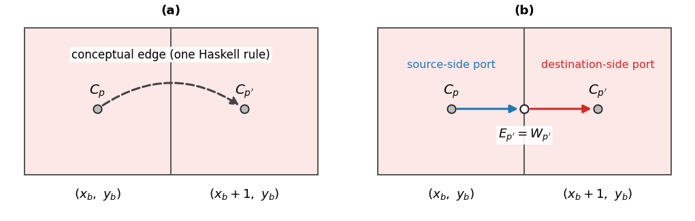

- $(dx, dy) = (1, 0)$ の場合 ($x$ を 1 増やす): ブロック $(x_b, y_b)$ の東辺と $(x_b+1, y_b)$ の西辺は同一の点 $E_{p'}@(x_b, y_b) = W_{p'}@(x_b+1, y_b)$ である。 これを中継点として:
  \begin{eqnarray}
  C_p \;@\; (x_b, y_b) &\to& E_{p'} \;@\; (x_b, y_b) \quad\text{(ソース側ポート)} \\
  W_{p'} \;@\; (x_b+1, y_b) &\to& C_{p'} \;@\; (x_b+1, y_b) \quad\text{(行先側ポート)}
  \end{eqnarray}
  辺ターミナルの idx は **行先 PC $p'$** を用いる (= 「PC $p'$ 行目に向かうための辺」 という意味)。

- $(dx, dy) = (-1, 0)$ ($x$ を 1 減らす): 西辺/東辺を中継:
  \begin{eqnarray}
  C_p \to W_{p'} \;@\; (x_b, y_b), \quad E_{p'} \to C_{p'} \;@\; (x_b - 1, y_b)
  \end{eqnarray}
- $(dx, dy) = (0, 1)$ ($y$ を 1 増やす): 北辺/南辺を中継: $C_p \to N_{p'} @ (x_b, y_b)$, $S_{p'} \to C_{p'} @ (x_b, y_b + 1)$
- $(dx, dy) = (0, -1)$ ($y$ を 1 減らす): 南辺/北辺を中継: $C_p \to S_{p'} @ (x_b, y_b)$, $N_{p'} \to C_{p'} @ (x_b, y_b - 1)$
- $(dx, dy) = (0, 0)$ (noop、 同一ブロック内): 分解不要、 単一ポート $C_p \to C_{p'}$ で完結。

#### 6.1.3 スタート / ゴール bridge

§4.1 で述べたとおり、 maze 仕様のスタート $W_0 @ (0, 0)$ / ゴール $W_1 @ (0, 0)$ は、 PC 0 / PC 1 を表す $C_0$ / $C_1$ に直接結ぶ:

\begin{eqnarray}
W_0 - C_0 \;@\; (0, 0) \quad\text{(スタート bridge)} \\
C_1 - W_1 \;@\; (0, 0) \quad\text{(ゴール bridge)}
\end{eqnarray}

これらは Haskell rule 由来ではなく `hs2maze` が固定で挿入する。 これにより、 Haskell の PC 0 (= エントリ rule) からの計算がスタート位置から始まり、 PC 1 (= HALT) に到達した時点でゴール位置に出る、 という対応が成立する。

### 6.2 ブロック種別の自動振り分け

`hs2maze` は各 Haskell rule の LHS パターンからゼロ分岐 (`DEC` の $r = 0$ 側) を検出し、 そのルールに対応するポートを以下のように **複数のブロック種別へ重複配置** する:

- **catch-all rule** (LHS が `(x, y, p)` のように両レジスタが変数で、 ゼロ条件なし) → `normal` / `nx` / `ny` / `zero` の **4 種すべて** に配置。 どの位置でもこの rule が発火しうるため。
- **`x = 0` ゼロ分岐** (LHS が `(0, y, p)`) → $x = 0$ となる **`nx` と `zero`** に配置。
- **`y = 0` ゼロ分岐** (LHS が `(x, 0, p)`) → $y = 0$ となる **`ny` と `zero`** に配置。


### 6.3 ターミナルインデックスの名前空間

- $C$ 以外 ($W, E, N, S$) のインデックス: 行先 PC $p'$ の値をそのまま使う (= $\{0, 1, \ldots, p_\max\}$)
- $C$ インデックス: PC 行番号 $p$ をそのまま使う ($C_0$ / $C_1$ は §4.1 のスタート / ゴール bridge anchor として予約)

辺ターミナル idx と C ターミナル idx はブロック種別 (`normal` / `nx` / `ny` / `zero`) ごとに独立した名前空間として管理されるため、 Haskell rule の PC 値と他のメタ情報が衝突することはない。

---

## 7. Haskell から無向グラフ迷路への変換 (`hs2maze`)

`tools/hs2maze/hs2maze.py` をオプションなし (デフォルト) で呼ぶと、 §6 の有向ポート列を出発点として **無向ポート列** に変換する。 出力は `normal` / `nx` / `ny` / `zero` の 4 ブロックそれぞれのポート集合として得られ、 各ポートは $A - B$ の形式で双方向に通行可能である。

### 7.1 変換方法

§6 の有向ポート列の各ポート $A \to B$ を、 そのまま無向ポート $A - B$ に書き換える。 §3.2 の定義より、 無向ポートは $A \to B$ と $B \to A$ の両方向の通行を許すため、 元の有向迷路を「双方向化」したことになる。

### 7.2 simplify と daisy chain

§7.1 で得た無向ポート列には大量の C ターミナル ($C_0$ / $C_1$ 以外、 idx $\geq 2$) が含まれる。 後段で **simplify (§7.2.1) → daisy chain (§7.2.2)** の 2 段で削減する。

#### 7.2.1 simplify

各ブロック種別の無向ポート集合 $P$ について、 idx $\geq 2$ の C ターミナル $t$ を頂点とみなし、 $t$ に接続するポート集合を

\begin{eqnarray}
I(t) &=& \{ (a - b) \in P \mid a = t \;\lor\; b = t \}
\end{eqnarray}

とする (§3.2 の無向ポート $a - b$ は $a, b$ の順序を区別しない)。 $|I(t)| = d$ を $t$ の **次数** と呼ぶ。 以下の不動点反復で C ターミナルを削減する:

\begin{eqnarray}
d = 1\;:&\quad& P \setminus I(t) \text{ のみ残し、 ぶら下がりポートを廃棄} \\
d = 2,\; I(t) = \{t - x,\; t - y\}\;:&\quad& P \;\leftarrow\; \big( P \setminus I(t) \big) \;\cup\; \{ x - y \}
\end{eqnarray}

(つまり次数 2 の C ターミナルを「通過点」として吸収し、 接続先 $x$, $y$ を直接結ぶ無向ポート $x - y$ に置き換える。 自己ループ $x = y$ は廃棄。) 上記いずれの規則も適用できなくなるまで繰り返し、 残った C ターミナルの idx を 2 から始まる連番に詰め直す ($C_0$ / $C_1$ は予約ペイロードのため対象外)。

下記は simplify の模式図である。 上段が $d = 1$、 下段が $d = 2$ の場合である。

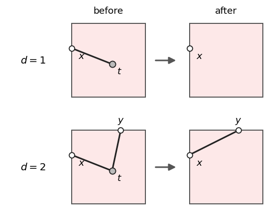

simplify は無向グラフのホモトピー類を変えない局所変形のみを行うため、 任意の 2 状態間の最短距離は保たれる (§7.3 で利用)。

#### 7.2.2 daisy chain

simplify 後に残った各 C ターミナル $t_C$ について、 $t_C$ に接続する辺ターミナル集合

\begin{eqnarray}
B(t_C) &=& \{ u \mid (t_C - u) \in P,\; u \in \{W, E, N, S\} \times \mathbb{Z} \}
\end{eqnarray}

を、 ブロックの外周に沿った時計反対回り順 (CCW、 $S_0, S_1, \ldots, E_n, E_{n-1}, \ldots, N_n, N_{n-1}, \ldots, W_0, W_1, \ldots$) に並べ替えて

\begin{eqnarray}
B(t_C) \text{ を CCW 順で } u_0, u_1, \ldots, u_{m-1} \text{ と並べる}
\end{eqnarray}

とおき、 隣接ペアを連結する **鎖状の無向ポート列** に展開する:

\begin{eqnarray}
P \;\leftarrow\; \big( P \setminus I(t_C) \big) \;\cup\; \{ u_i - u_{i+1} \mid 0 \leq i < m - 1 \}
\end{eqnarray}

これにより C ターミナル $t_C$ は最終的に出力ポート集合から消え、 元々 $t_C$ で集約されていた辺ターミナル群はブロック外周に沿った隣接連結で繋がる。 全ての C ターミナル ($C_0$ / $C_1$ を含む) に対してこの置換を行い、 出力 maze ファイルからは C ターミナルが完全に消失する。

下記は daisy chain の模式図である。 左が置換前 ($t_C$ を中心とする星型)、 右が置換後 (CCW 順の鎖) である。

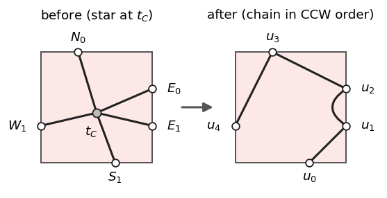

### 7.3 無向化しても最短経路長が変わらないことの証明

§7.1 で得た無向迷路は、 §6 の有向迷路の各ポートを双方向化したものである。 逆向きにも辿れるため、 一見するとショートカットが生じうるように思われるが、 実際には最短経路長は変わらない。

#### 主張

§6 の有向迷路を $G$、 §7.1 で無向化した迷路を $U$ とする。 スタート $s$ (ブロック $(0, 0)$ の $W_0$) からゴール $g$ (同ブロックの $W_1$) までの最短経路長について

\begin{eqnarray}
d_U(s, g) &=& d_G(s, g)
\end{eqnarray}

が成り立つ。

#### 証明

$G$ では、 各頂点から前向きに出る辺は高々 1 本である (Haskell の関数 `machine` は右一意であり、 §6.1 のポート分解はこれを保つ)。 また $g$ から前向きに出る辺は無い (HALT)。

$G$ の頂点のうち、 前向きに辿ると $g$ に着くものだけを集める。 各頂点から前向きの辺を辿る道は 1 本しかなく、 その道は $g$ で止まるので、 これらの頂点と前向きの辺は **$g$ を根とする木** をなす (各頂点の親は、 前向きの辺の先の頂点)。

この木の頂点 $u$ に $U$ でつながる頂点 $v$ は、 必ずこの木に入っている。 元の辺が $u \to v$ なら $v$ は $u$ の親であり、 $v \to u$ なら $v$ は $u$ を経由して $g$ に着くからである。 したがって、 $U$ で $g$ から行ける範囲はこの木だけである。

木では 2 頂点を結ぶ道は 1 本しかない。 よって $U$ での $s$ から $g$ への道は、 $s$ から根 $g$ へ前向きに辿る道と同じであり、 最短経路長は $G$ と等しい。 $\blacksquare$

#### simplify と daisy chain による最短経路長の変化について

simplify と daisy chain は 1 ブロック内の局所変形であり、 新しい連結は作らない。 ただし最短経路長は変わりうる。 simplify の $d = 2$ の吸収 $x - t - y \to x - y$ は経路を短くし、 daisy chain は星型 (どの 2 点間も 2 歩) を鎖 (隣り合う 2 点間は 1 歩、 離れた 2 点間はより長い) に置き換える。 どちらも最短経路長の増加は総ポート数の定数倍の範囲に収まる。

---

## 8. ブロックの大きさの増加に対して最短経路の長さが大きな関数のオーダーで増える迷路

§7.3 により、 `hs2maze` で生成される迷路のスタート→ゴール最短経路長 $L^*$ は、 §6 の有向迷路の最短経路長と定数倍の範囲で一致する。 §6 の有向迷路では 2 レジスタ Haskell の 1 ステップが 1 本または 2 本のポートになるので、 $L^*$ は 2 レジスタ Haskell の計算ステップ数 $T_\mathrm{step}$ に対して $L^* = \Theta(T_\mathrm{step})$ である。 したがって、 計算ステップ数をブロックの大きさに対して巨大関数のオーダーで増大させるミンスキーマシンを構成すれば、 最短経路長も同じオーダーで巨大数になる。

### 8.1 構成

有限のプログラム行数のミンスキーマシンで記述できる $\mathbb{N} \to \mathbb{N}$ 型の巨大関数を $f$ とし、 これを計算するミンスキーマシン $M_f$ を 1 つ用意する。 $M_f$ は $(r_0, r_1, \mathit{pc})$ を状態として、 PC を $k$ 個消費しながら状態 $(n, 0, n+1)$ から状態 $(0, f(n), n+k)$ へ到達するものとする (= 入力 $n$ を $r_0$ に置いて起動し、 出力 $f(n)$ を $r_1$ に得る形式)。

$M_f$ に以下の 2 種類の Haskell rule を追加した拡張マシン $M_f'$ を構成する。

#### 入力セットアップ: INC chain

PC 0 から開始して $r_0$ を 0 から $n$ まで INC する chain:

\begin{eqnarray}
(0, 0, 0) \to (1, 0, 2) \to (2, 0, 3) \to \cdots \to (n, 0, n+1)
\end{eqnarray}

PC を $n+1$ 個 (0, 2, 3, …, n+1) 消費する。 終端で $M_f$ の入口状態 $(n, 0, n+1)$ に到達する。

#### 出力ドレイン: DEC chain

$M_f$ 出口 $(0, f(n), n+k)$ から PC 1 (HALT) で $r_1$ を $f(n)$ から 0 まで DEC する chain:

\begin{eqnarray}
(0, j+1, 1) \to (0, j, 1) \quad (0 \leq j < f(n))
\end{eqnarray}

これは Haskell の単一行 `machine (0, y, 1) = machine (0, y-1, 1)` で実現できる ($y > 0$ のとき発火、 $y = 0$ で HALT)。

---

## 9. 具体的な迷路族の構築

§8 の構成に基づき、 オーダーの異なる迷路族を 4 種類構築する。

### 9.1 カウンターポンプ 2 レジスタ版(Θ(n^2))

カウンターポンプ (counter pump) は、繰り返し迷路だけが持つ「同じパターンが格子状に並ぶ」性質を利用して、 ミンスキーマシンの計算過程を「ポンプ」のように非対称に蓄積・放出することで多項式オーダーの経路長を実現する設計である。

`maze/counter-pump/make-cp2.py` は、 パラメータ $n$ を受けて 2 レジスタミンスキーマシンの Haskell ソース `cp2-N.hs` を自動生成する。 内部構造は以下:

- **Phase 1** (`pc=2..n+1`): $x := n$ (=$n$ 回 INC で $x$ レジスタを蓄積)
- **Phase 2** (`pc=n+3`): 外側ループ。 $x > 0$ の間、 内側で $n$ 回 INC $y$ を実行してから DEC $x$
- **Phase 3** (`pc=2n+2`): $y$ を 0 まで排出するドレインフェーズ
- **HALT** (`pc=2n+3`): noop で `pc=1` へ

経路長は $n$ に対して $\Theta(n^2)$ オーダーで増大する。 リポジトリには $n = 3, 4, 5, 6$ の例が含まれる:

| ファイル | $n$ | 全ターミナル数 $T$ | 最短経路長 |
|---|---|---|---|
| `cp2-3.hs` | 3 | 13 | 59 |
| `cp2-4.hs` | 4 | 15 | 98 |
| `cp2-5.hs` | 5 | 17 | 147 |
| `cp2-6.hs` | 6 | 19 | 206 |

(具体値は `tools/solver/solver.py` で実測。 visualizer の preset としても提供されている。)

`maze/counter-pump/cp2-3.maze` の出力例:

```
normal: S8-N9, S12-N12, E11-N8, N8-W5, E5-W4, S9-N10, S10-W11, S2-W0, E3-N2, E4-W3;
nx:     S8-N9, S12-E11, E11-N12, N12-N8, S9-N10, S2-W0, E3-N2;
ny:     N12-W1, E11-N8, N8-W5, E5-W4, E3-N2, N2-W0, E4-W3;
zero:   E11-N12, N12-N8, N8-W1, E3-N2, N2-W0
```

下記は n=3 の描画例である。

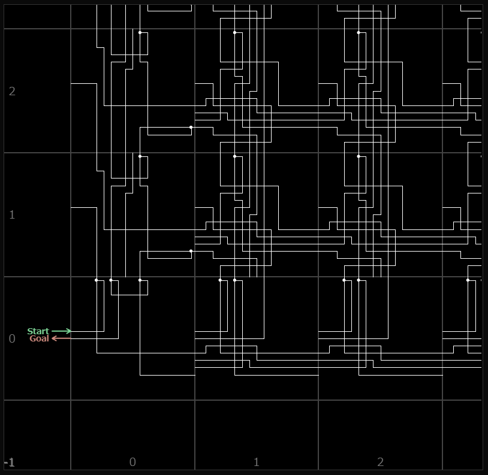

下記は n=3 の最短経路の描画例である。

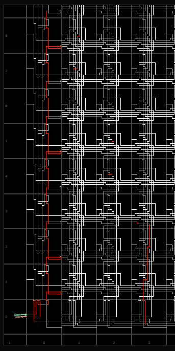

まず x=n=3 まで n=3 のターミナルを使って右移動をする。
その後、上に n=3 回移動して y を増やす。
その後、x を 1 減らして、再び上に n=3 回移動して y を増やす。
これを x=0 になるまで繰り返す。
これより $n\cdot n=n^2$ 回の上移動が行われる。

### 9.2 カウンターポンプ 3 レジスタ版(Θ(n^3))

3 レジスタ版カウンターポンプ `maze/counter-pump-3/cp3-N-3d.hs` を、 §5 の `nd-to-2d.py` で 2 レジスタ Gödel 化した上で `hs2maze` に通すと、 cp2 より高次の多項式オーダーの経路長を持つ迷路が得られる:

| ファイル | n_regs | 全ターミナル数 $T$ | 最短経路長 |
|---|---|---|---|
| `cp3-2.maze` | 3 | 179 | 32,783 |
| `cp3-3.maze` | 3 | 207 | 1,230,549 |
| `cp3-4.maze` | 3 | 235 | 40,511,987 |

cp3-2 は visualizer の preset としても提供されており、 cp2 系よりさらに長い経路を持つ。

下記は n=2 の描画例である。

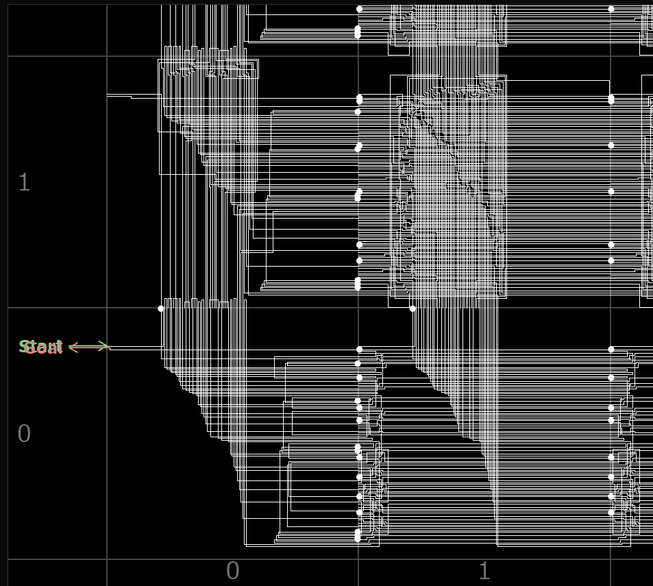

下記は n=2 の最短経路の描画例である。

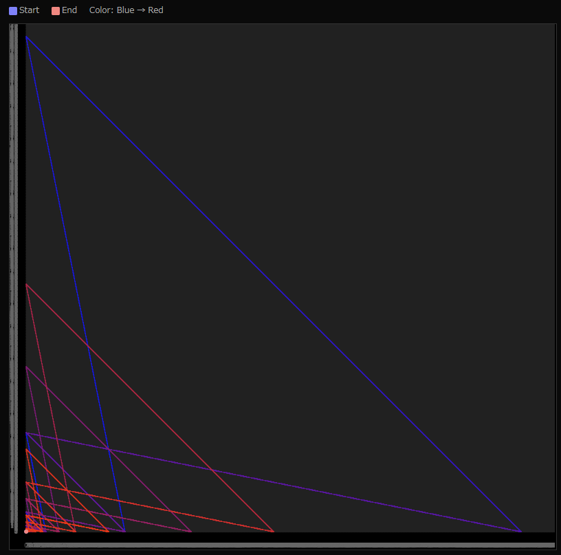

(x,y) の動きだけを図示している。ゲーデル化のためにこの図を見ても計算の内容はよく分からないが、x=0 の辺と y=0 の辺を直線上に行き来していることが分かる。

### 9.3 ミンスキー倍加マシン (最短経路長 $\Theta(2^k)$)

カウンターポンプは多項式オーダーの増大に留まる。これを **指数オーダー** に押し上げるため、ミンスキーマシンによる「倍加」を $k$ 回反復する設計を導入する。

#### 9.3.1 倍加マシンの定義

サイクル $k$ のミンスキー倍加マシン $\mathrm{md}_k$ は、アフィン写像 $y \mapsto 2y + 1$ を $k$ 回適用し、$y_0 = 1$ から始めて

\begin{eqnarray}
y_0 = 1 \to y_1 = 3 \to y_2 = 7 \to \cdots \to y_k = 2^{k+1} - 1
\end{eqnarray}

を計算する。

各サイクルは 2 フェーズで構成される:

| フェーズ | 命令ループ | 効果 |
|---|---|---|
| フェーズ 1 (奇 PC) | `while y > 0: x += 2; y -= 1` | $x$ に $2y$ を蓄積、$y$ を 0 に。`ny` でゼロテスト。 |
| フェーズ 2 (偶 PC) | `while x > 1: x -= 1; y += 1` | $x$ を 1 まで戻し、$y$ に $x - 1$ を蓄積。`nx` でゼロテスト。 |

サイクル後の $y$ は $y_\mathrm{new} = 1 + 2 y_\mathrm{old}$ となる。
最終サイクル後にドレインフェーズで $y$ を 0 まで排出し、 HALT 状態 $(x, y, \mathit{pc}) = (0, 0, 1)$ で停止する (迷路上ではブロック $(0, 0)$ のゴール $W_1$)。

#### 9.3.2 例: $k = 3, 4, 5$

`maze/minsky-doubling/md{3,4,5}.hs` は補助スクリプト `make-minsky-doubling.py` で生成され、 `hs2maze` (§7) を通すと `md{3,4,5}.maze` (無向) が得られる。 現実装ではゼロ分岐ポート (`nx` / `ny` / `zero`) も `hs2maze` が自動生成するため、 旧版で必要だった追加ポートの手動連結作業は不要である。

| $k$ | $y_k = 2^{k+1} - 1$ | 経路長 (ステップ数) | 全ターミナル数 $T$ (実測) |
|---|---|---|---|
| 3 | 15 | 117 | 18 |
| 4 | 31 | 245 | 23 |
| 5 | 63 | 501 | 28 |

経路長は $k$ に対して概ね $\Theta(2^k)$ で増大する。
全ターミナル数 $T$ はサイクルごとに約一定数増えるため、 ターミナル数に対する **指数オーダー** の最短解長を持つ繰り返し迷路となる。

`md3.hs` から生成される迷路 (一部抜粋):

```
normal: S2-S3, S3-W2, E4-N3, S5-W6, E16-N15, S8-W7, ...  (18 ports)
nx:     S2-S3, S5-S8, E4-N3, S10-S13, E16-N15, S15-S17, ...  (12 ports)
ny:     W2-W6, E4-N3, W7-W11, E16-N15, N17-W1, E2-W4, ...  (14 ports)
zero:   N17-W1, E4-N3, E16-N15, N2-W0, E9-N8, E6-N5, ...  (8 ports)
```

経路 (117 ステップ): $(0, 0, W_0) \to (0, 0, N_2) \to (0, 1, S_2) \to \cdots \to (0, 0, N_{17}) \to (0, 0, W_1)$

下記は n=3 (最短経路長 $approx 2^3$) の描画例である。

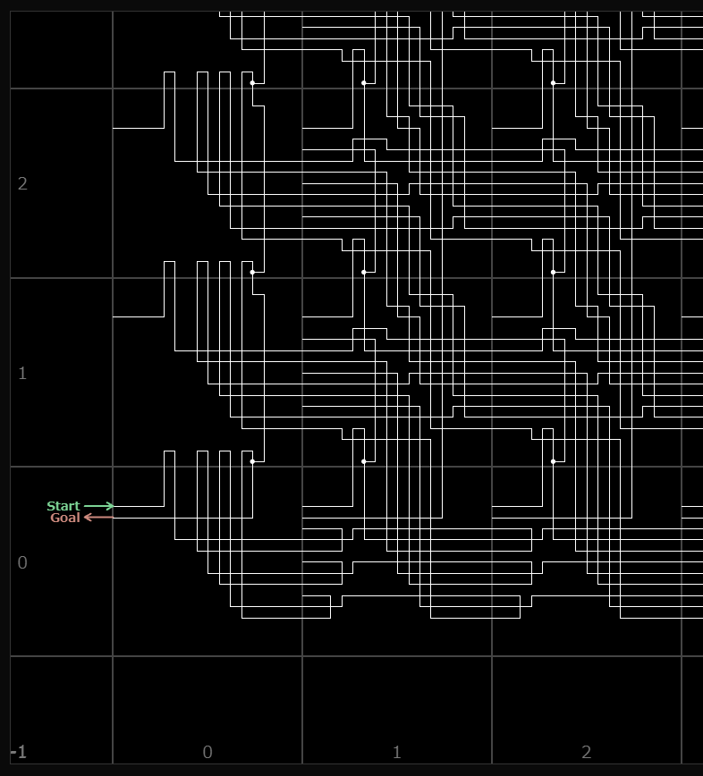

下記は n=3 の最短経路の描画例である。

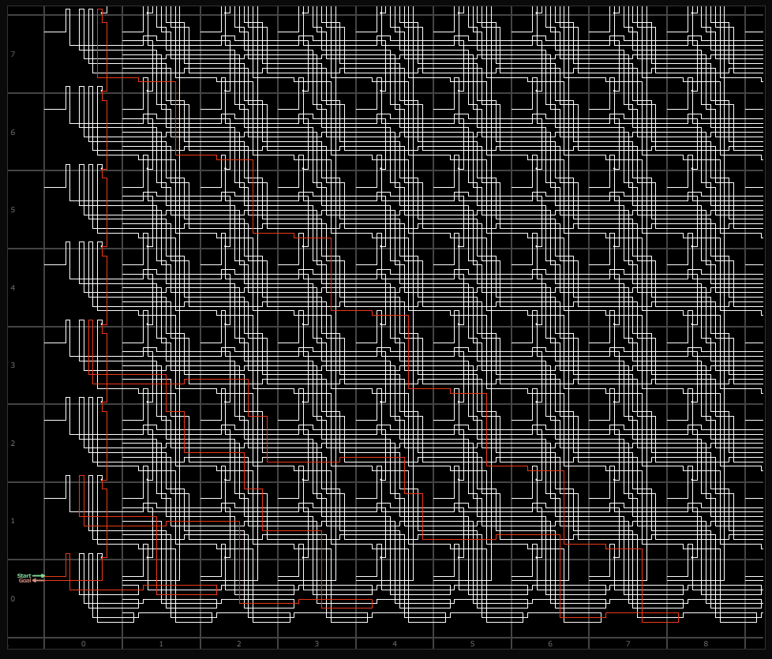

まず (x,y)=(1,0) に向かう。そこから下記のように動く。
- (-1,+1) の方向に進んで左端の (0, y) に到達
- (+2,-1) の方向に進んで下端の (x, 0) に到達
- (-1,+1) の方向に進んで左端の (0, y) に到達
- (+2,-1) の方向に進んで下端の (x, 0) に到達
- ...
- これを n 回繰り返して左端の (0, y) に到達
- (0,-1) 方向に $2^n - 1$ 回進んで (0,0) に到達

下記は n=5 (最短経路長 $approx 2^5$) の描画例である。

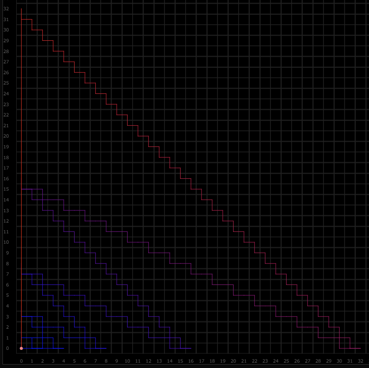

### 9.4 ペンテーション迷路 (最短経路長 $\Omega(3^{2 \uparrow\uparrow\uparrow n})$)

ミンスキー倍加が指数オーダー $\Theta(2^k)$ で頭打ちになるのに対し、 §8 で示した「巨大関数 $f$ を計算するミンスキーマシン $M_f$ をブロックに埋め込む」 構成を $f(n) = 2 \uparrow\uparrow\uparrow n$ (ペンテーション) に適用すると、 入力 $n$ に対して経路長 $L^* = \Omega(3^{2 \uparrow\uparrow\uparrow n})$ の迷路が得られる (計算結果はゲーデル符号化 $x = 3^{2 \uparrow\uparrow\uparrow n}$ として迷路の座標に現れ、 これを 0 まで減らすだけで $x$ 歩かかるため)。

これは旧版 [ペンテーション迷路](https://googology.fandom.com/ja/wiki/%E3%83%A6%E3%83%BC%E3%82%B6%E3%83%BC%E3%83%96%E3%83%AD%E3%82%B0:Koteitan/%E3%83%9A%E3%83%B3%E3%83%86%E3%83%BC%E3%82%B7%E3%83%A7%E3%83%B3%E8%BF%B7%E8%B7%AF) (koteitan, 2025) の再構成である。 旧版は 23 種類のブロックと位置依存規則で密度を稼いでいたが、 本研究では §6 / §7 / §5 のパイプライン (Haskell 記述 → `hs2maze` → 4 種ブロック迷路、 必要に応じて `nd-to-2d` で n レジスタを 2 レジスタ化) を通すことで、 **均一な 4 種ブロック (`normal` / `nx` / `ny` / `zero`)** のみで構成される繰り返し迷路に落とし込めることを示す。

#### 9.4.1 構成

`maze/penta/make_penta.py` は、 入力 $r_0 = a$ ($a$ は非負整数) を Gödel 符号化 $x = 2^a$ として 2 レジスタミンスキーマシンに与え、 14 個の Fractran 形式ルールでペンテーション計算を行う Haskell ソース [`penta.hs`](../maze/penta/penta.hs) を自動生成する。 具体的には、 Minsky 1967 のレジスタマシンとして以下を実装する:

- **Phase 1**: `pc=0..` で $2^a$ 回 INC x、 入力 $x = 2^a$ をセットアップ
- **Phase 2**: 14 ルール first-match のループ ($x$ の素因数分解パターンに応じた $a/b$ Fractran 操作を実行)
- **Phase 3**: HALT 条件 ($2 \nmid x \wedge 5 \nmid x$) 成立後に $x$ を 0 まで drain し、 `pc=1` で HALT

各 ルールの test_ndiv (非破壊的可除性テスト) と mul_p / div_p (定数倍乗除算) は §8 の汎用構成と同じパターンの INC/DEC chain で実装される。

入力 $a$ に対して計算結果は $r_1 = 2 \uparrow\uparrow\uparrow a$ (Gödel 符号化後 $x = 3^{2 \uparrow\uparrow\uparrow a}$) となる。

$a = 4$ の場合の Haskell は [`penta.hs`](../maze/penta/penta.hs) である。
これを `hs2maze` で迷路に変換したものは [`penta.maze`](../maze/penta/penta.maze) である。
`penta.maze` の端子数は 22400、 ポート数は 11494 である。
`penta.maze` の最短経路長は $3^{2 \uparrow\uparrow\uparrow 4} = 3^{\overbrace{2^{2^{\cdot^{\cdot^{\cdot^{2}}}}}}^{65536 \text{ 個}}}$ 程度であると推測できる。

---

## 10. Lean による形式化

§1.4 の貢献 6 で述べた 2 つの定理 (到達判定の決定不能性と、 最短経路長の最大値 $L(n)$ がどんな計算可能関数でも上から抑えられないこと) は、 Lean 4 + Mathlib で `sorry` なしに証明してある。 定理の正確な主張、 定義、 証明の流れ、 検証方法は GitHub の [lean/README-ja.md](https://github.com/koteitan/repeated-maze/blob/main/lean/README-ja.md) にまとめた。

---

## 参考文献

- 1967: M. L. Minsky, *Computation: Finite and Infinite Machines*, Prentice-Hall, 1967.
- 1981: John E. Hutchinson, ["Fractals and Self Similarity"](https://maths-people.anu.edu.au/~john/Assets/Research%20Papers/fractals_self-similarity.pdf), Indiana University Mathematics Journal, Vol. 30, No. 5 (1981), pp. 713–747.
- 1999: M. J. P. Wolf, "FRACTAL MAZES", [Extropy](https://www.extropy.org/) #17, 1999, pp. 67-68.
- 2018: omeometo, "[fractal mazeとか](https://omeometo.hatenablog.com/entry/2018/12/28/155549)", omeometo の日記, 2018.
- 2021: omeometo, "[ピラミッド迷路](https://x.com/omeometo/status/1436627948677648384)", Twitter, 2021.
- 2025: koteitan, "[繰り返し迷路の歴史](https://googology.fandom.com/ja/wiki/%E3%83%A6%E3%83%BC%E3%82%B6%E3%83%BC%E3%83%96%E3%83%AD%E3%82%B0:Koteitan/%E7%B9%B0%E3%82%8A%E8%BF%94%E3%81%97%E8%BF%B7%E8%B7%AF%E3%81%AE%E6%AD%B4%E5%8F%B2)", 巨大数研究 Wiki ブログ.
- 2025: koteitan, "[ペンテーション迷路](https://googology.fandom.com/ja/wiki/%E3%83%A6%E3%83%BC%E3%82%B6%E3%83%BC%E3%83%96%E3%83%AD%E3%82%B0:Koteitan/%E3%83%9A%E3%83%B3%E3%83%86%E3%83%BC%E3%82%B7%E3%83%A7%E3%83%B3%E8%BF%B7%E8%B7%AF)", 巨大数研究 Wiki ブログ, 2025.
- 2026: koteitan, [repeated-maze (GitHub Pages)](https://koteitan.github.io/repeated-maze/), 2026.
